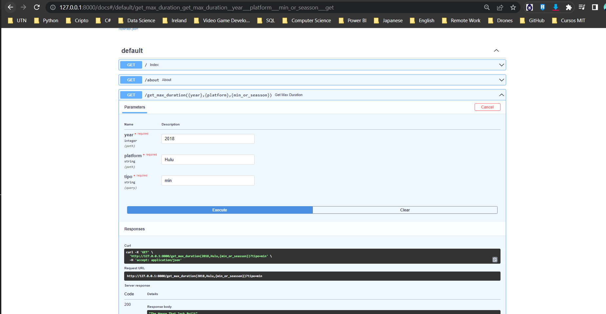

#<h1> **INDIVIDUAL PROJECT N°1** </h1>
#<h1> **Autor: HECTOR JAVIER HERRERA ESPINOLA** </h1>

Last updated 21/01/2023

  

# <h1 align="center">**`DATA ENGINEERING WITH PYTHON-FASTAPI-DOCKER FOR DATA OF STREAMING PLATFORMS`**</h1>

### **INTRODUCTION**
This project is part of the Labs stage of the Data Science course at acamedia Soy Henry.
This time it provides sources of information associated with streaming platforms, such as:
- Amazon Prime Video
- Disney Plus
- Hulu
- Netflix
 

### **OBJETIVE**
The project consists of a data ingestion from various sources delivered by the chair, to apply transformations in the datasets that allow queries through an API (in a dockerized virtual environment).
In the following link you will have access to the repository of the original project (in Spanish): [Statement]("https://github.com/HX-FAshur/PI01_DATA05")
The files are available in this repository and the information will be about movies and series from the following platforms:
 [Datasets]("https://github.com/hectorherreraespinola/Proyecto_Individual_01_Soy-Henry-/tree/main/Datasets")

 

**SCOPE OF WORK**.
The work proposal will be carried out in the following stages:
1. Exploratoy Data Analysis (EDA-ETL) and Extract-Tranform and Load with the Python language.
2. Generation/Creation of an API to perform queries in a dockerized environment.
3.  Run the API in a local host
4. Performing a deployment in Mogenius

## EDA-ETL
As an initial step, the data will be loaded using the pandas library. In this instance, an exploratory analysis of the data will be performed and the necessary transformations will be made to clean the data. 
necessary transformations for data cleaning.
To see in more detail the work done with the ETD and ETL please access the following link: [EDA / ETL]("DATA-ENGINEERING01\Transformaciones.ipynb")

**FastAPI**
For the creation of the API, the main.py file was used. With that, the API was built locally, and the functions for performing queries were configured. The API loads the CSV already transformed to perform the queries, and returns the expected results.

For this project, only 4 types of queries were requested.

+ Maximum duration by type of film (movie/series), by platform and by year:
    The request should be: get_max_duration(year, platform, [min or season]).

+ Number of movies and series (separately) per platform.
    The request should be: get_count_plataform(platform)  
  
+ Number of times a genre and platform is repeated most often of the same genre and platform.
    The request should be: get_listedin('genre')  
    As an example of genre you can use 'comedy', which should return a cunt of 2099 for the amazon platform.

+ Most repeated actor by platform and year.
  The request should be: get_actor(platform, year)

**Docker Enviroment**

For the creation of the container, Dockerfile was used. This tells us that we are going to use a container that already has the Python functions, with the necessary libraries to load the API. This is done with the Docker Desktop application for Windows, and with a few lines in the Visual Studio Code terminal.

*Queries*
Once the container is already active, the docs URL is loaded to perform the queries, or also with the direct URL:
localhost:8000/get_max_duration(2018,'Hulu','min').
Once we check that the queries deliver the expected results, we terminate the queries by clicking on the following link

**RESULT**
Se adjunta a modo ejemplo la imagen de la API de consultas en funcionamineto

