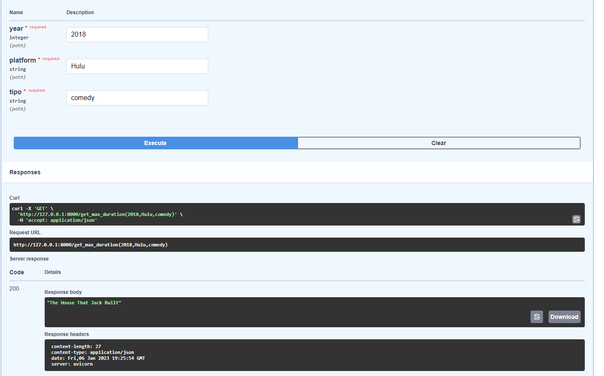

#<h1> **PROYECTO INDIVIDUAL N°1** </h1>
#<h1> **Autor: HECTOR JAVIER HERRERA ESPINOLA** </h1>

Fecha actualización 6/01/2023

  

# <h1 align="center">**`EDA_ELT CON PYTHON-FASTAPI-DOCKER EN PLTAFORMAS DE STREAMING`**</h1>

### **INTRODUCCION**
Este proyecto es parte de la etapa de Labs de la carrera de Ciencia de Datos de la acamedia Soy Henry.
En esta ocasión se provee de fuentes de información asociada a plataformas de streams, tales como:
- Amazon Prime Video
- Disney Plus
- Hulu
- Netflix
 

### **OBJETIVO**
El proyecto consiste en realizar una ingesta de datos desde varias fuentes entregado por la cátedra, para aplicar las transformaciones en los datasets que permita realizar consultas a través de una API (en un entorno virtual dockerizado.)
En el siguiente link tendrán acceso al repositorio del proyecto original: [Enunciado_Proyecto]("https://github.com/HX-FAshur/PI01_DATA05")
Los archivos se encuentra disponibles en este repositorio y la información será sobre películas y series de las siguientes plataformas:

Para tener detalles de los archivos pueden abrir los [Datasets]("https://github.com/hectorherreraespinola/Proyecto_Individual_01_Soy-Henry-/tree/main/Datasets")

 

### **PROPUESTA DE TRABAJO**
La propuesta de trabajo se realizará en las siguientes etapas:
1. Exploratoy Data Analysis (EDA-ETL) y Extract-Tranform and Load con el lenguaje Python.
2. Generación/Creación de una API para realizar consultas en un entorno dockerizado.
3.  
4. Realizar un deployment en Mogenius

## EDA-ETL
Como punto inicial se procederan a cargar los datos mediante el uso de la librería pandas. En esta instancia se realizara un análisis exploratirio de los datos y a su vez se realizarán las 
transformaciones necesarias para la limpieza de estos.
Para ver con más detalles el trabajo realizado con el ETD y ETL por favor ingresar al siguiente enlace: [EDA / ETL]("PI01_DATA05\Transformaciones.ipynb")

**FastAPI**
Para la creación de la API, se utilizó el archivo main.py. Con eso se levantó la API de manera local, y se configuraron las funciones para la realización de consultas. La API carga el CSV ya transformado para realizar las consultas, y devuelve los resultados esperados.

Para este proyecto, se solicitaban únicamente 4 tipos de consultas

+ Máxima duración según tipo de film (película/serie), por plataforma y por año:
    El request debe ser: get_max_duration(año, plataforma, [min o season])

+ Cantidad de películas y series (separado) por plataforma
    El request debe ser: get_count_plataform(plataforma)  
  
+ Cantidad de veces que se repite un género y plataforma con mayor frecuencia del mismo.
    El request debe ser: get_listedin('genero')  
    Como ejemplo de género pueden usar 'comedy', el cuál deberia devolverles un cunt de 2099 para la plataforma de amazon.

+ Actor que más se repite según plataforma y año.
  El request debe ser: get_actor(plataforma, año)

**Entorno Docker**

Para la creación del contenedor, se utilizó Dockerfile. Este nos indica que vamos a utilizar un contenedor que ya trae las funciones de Python, con las librerías necesarias para cargar la API. Esto se realiza con la aplicación Docker Desktop para Windows, y con algunas líneas en la terminal del Visual Studio Code.
Consultas
Una vez que ya está activo el contenedor, se carga la URL docs para realizar las consultas, o también con la URL directa:
localhost:8000/get_max_duration(2018,'Hulu','min')
Al revisar que las consultas entregan los resultados esperados, se dan por finalizadas las consignas requeridas.

**Resultado de Consultas**
Se adjunta a modo ejemplo la imagen de la API de consultas en funcionamineto

